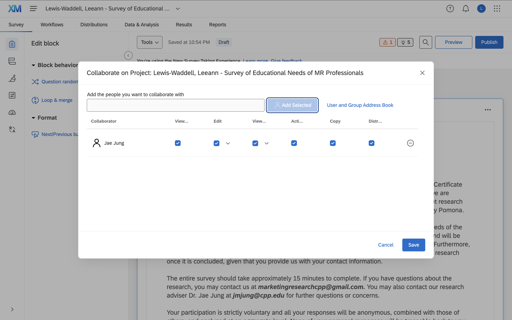
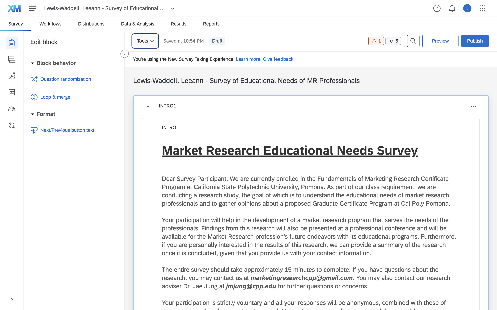
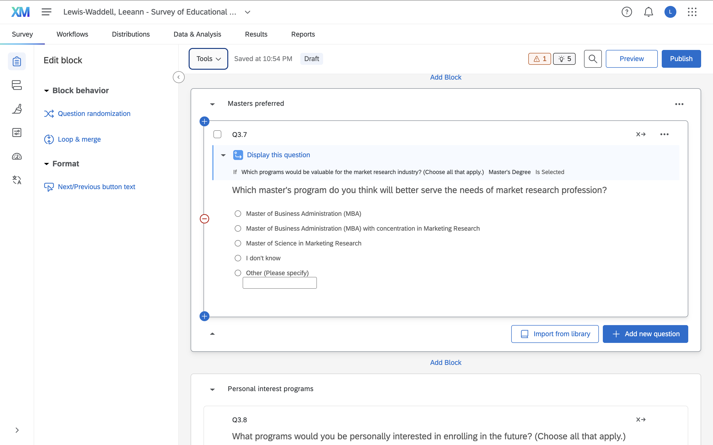
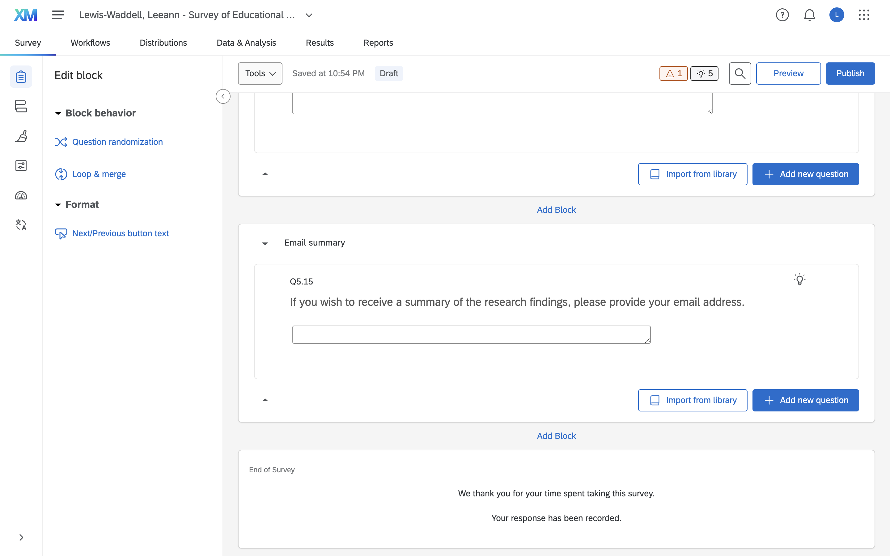

# Qualtrics Shared Evidence

{fig-align="center" width="800"}

# Beginning of Qualtrics Survey

{width="800"}

# Middle of Qualtrics Survey

{width="800"}

# End of Qualtrics Survey

{width="800"}

# Appendix

- GitHub Repository

- GitHub Pages